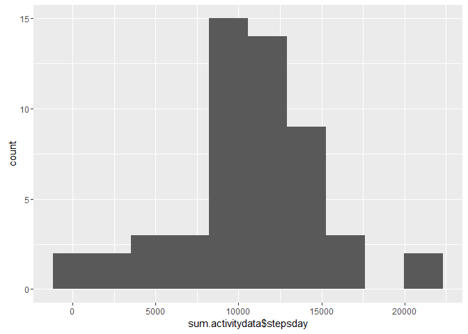
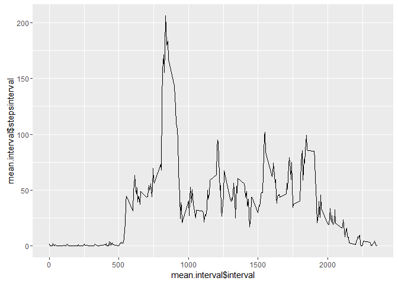
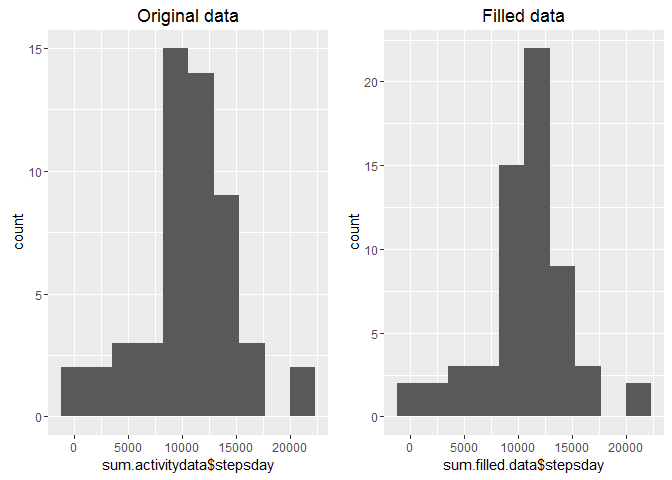
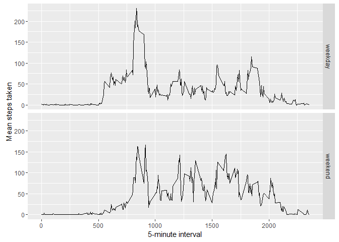

# Reproducible Research: Peer Assessment 1


## Loading and preprocessing the data


```r
## Unzip the file and read in one line

activitydata <- read.csv(unzip("activity.zip"), sep = ",")

## Format the date column as.Date

activitydata$date <- as.Date(activitydata$date)

head(activitydata)
```

```
##   steps       date interval
## 1    NA 2012-10-01        0
## 2    NA 2012-10-01        5
## 3    NA 2012-10-01       10
## 4    NA 2012-10-01       15
## 5    NA 2012-10-01       20
## 6    NA 2012-10-01       25
```


## What is mean total number of steps taken per day?


```r
## Load dplyr package to summarise the number of steps and ggplot2 for the plot

source("multiplot.R")
library(dplyr)
library(ggplot2)
library(lubridate)

## 1. Calculate the total number of steps taken per day

## Create a new data set without NAs

unfilled.data <- activitydata[complete.cases(activitydata), ]

## Sum all the steps taked each day by summarising the data of each date ignoring dates that have NA values

sum.activitydata <- unfilled.data %>%
    group_by(date) %>%
    summarise(stepsday = sum(steps))

head(sum.activitydata)
```

```
## Source: local data frame [6 x 2]
## 
##         date stepsday
##       (date)    (int)
## 1 2012-10-02      126
## 2 2012-10-03    11352
## 3 2012-10-04    12116
## 4 2012-10-05    13294
## 5 2012-10-06    15420
## 6 2012-10-07    11015
```

### 2. If you do not understand the difference between a histogram and a barplot, research the difference between them. Make a histogram of the total number of steps taken each day


```r
## Plot the number of steps taken each day

qplot(x = sum.activitydata$stepsday, bins = 10)
```

<!-- -->


### 3. Calculate and report the mean and median of the total number of steps taken per day


```r
## Calculate the mean and median of the summarised data

meansteps <- mean(sum.activitydata$stepsday)

mediansteps <- median(sum.activitydata$stepsday)

paste("Mean", as.integer(meansteps))
```

```
## [1] "Mean 10766"
```

```r
paste("Median", as.integer(mediansteps))
```

```
## [1] "Median 10765"
```


## What is the average daily activity pattern?


```r
## Sum all the steps taken in each 5-minute interval

mean.interval <- unfilled.data %>%
    group_by(interval) %>%
    summarise(stepsinterval = mean(steps))
```

### 1. Make a time series plot (i.e. type = "l") of the 5-minute interval (x-axis) and the average number of steps taken, averaged across all days (y-axis)


```r
qplot(mean.interval$interval, mean.interval$stepsinterval, geom = "line")
```

<!-- -->


## Imputing missing values

### 1. Calculate and report the total number of missing values in the dataset (i.e. the total number of rows with NAs)


```r
NAscount <- table(complete.cases(activitydata))[[1]]

paste("Number of values with NA:", NAscount)
```

```
## [1] "Number of values with NA: 2304"
```

### 2. Devise a strategy for filling in all of the missing values in the dataset. The strategy does not need to be sophisticated. For example, you could use the mean/median for that day, or the mean for that 5-minute interval, etc.

### 3. Create a new dataset that is equal to the original dataset but with the missing data filled in.


```r
## Join the original data set with the one that has the mean for each interval, to fill in the missing values

## round the mean values of each interval

mean.interval$stepsinterval <- as.integer(round(mean.interval$stepsinterval, digits = 0))

## Create a new data frame that has all the NA values filled with the mean of each 5 minute interval

filled.data <- inner_join(filter(activitydata, is.na(steps)), mean.interval, by = "interval")

filled.data <- rename(select(filled.data, -1), steps = stepsinterval)

filled.data <- rbind(filled.data, filter(activitydata, !is.na(steps)))

## Reorder the columns to match the original data set

filled.data <- select(filled.data, steps, date, interval)
```

### Original data, not filled looks like this


```r
glimpse(activitydata)
```

```
## Observations: 17,568
## Variables: 3
## $ steps    (int) NA, NA, NA, NA, NA, NA, NA, NA, NA, NA, NA, NA, NA, N...
## $ date     (date) 2012-10-01, 2012-10-01, 2012-10-01, 2012-10-01, 2012...
## $ interval (int) 0, 5, 10, 15, 20, 25, 30, 35, 40, 45, 50, 55, 100, 10...
```

### Filled data looks like this


```r
glimpse(filled.data)
```

```
## Observations: 17,568
## Variables: 3
## $ steps    (int) 2, 0, 0, 0, 0, 2, 1, 1, 0, 1, 0, 0, 0, 1, 0, 0, 0, 1,...
## $ date     (date) 2012-10-01, 2012-10-01, 2012-10-01, 2012-10-01, 2012...
## $ interval (int) 0, 5, 10, 15, 20, 25, 30, 35, 40, 45, 50, 55, 100, 10...
```

### 4. Make a histogram of the total number of steps taken each day and Calculate and report the mean and median total number of steps taken per day. Do these values differ from the estimates from the first part of the assignment? What is the impact of imputing missing data on the estimates of the total daily number of steps?


```r
sum.filled.data <- filled.data %>%
    group_by(date) %>%
    summarise(stepsday = sum(steps))

a <- qplot(x = sum.activitydata$stepsday, bins = 10, main = "Original data")

b <- qplot(x = sum.filled.data$stepsday, bins = 10, main = "Filled data")

multiplot(a, b, cols=2)
```

<!-- -->

```r
## Mean and median of the original data

paste("Mean:", round(mean(sum.activitydata$stepsday)), "Median:", median(sum.activitydata$stepsday))
```

```
## [1] "Mean: 10766 Median: 10765"
```

```r
## Mean and median of the filled data

paste("Mean:", round(mean(sum.filled.data$stepsday)), "Median:", median(sum.filled.data$stepsday))
```

```
## [1] "Mean: 10766 Median: 10762"
```

## Are there differences in activity patterns between weekdays and weekends?

### 1. Create a new factor variable in the dataset with two levels - "weekday" and "weekend" indicating whether a given date is a weekday or weekend day.


```r
filled.data$day_type <- "weekday"
filled.data$day_type[wday(filled.data$date) == 7 | wday(filled.data$date) == 1] <- "weekend"

filled.data$day_type <- as.factor(filled.data$day_type)

str(filled.data)
```

```
## 'data.frame':	17568 obs. of  4 variables:
##  $ steps   : int  2 0 0 0 0 2 1 1 0 1 ...
##  $ date    : Date, format: "2012-10-01" "2012-10-01" ...
##  $ interval: int  0 5 10 15 20 25 30 35 40 45 ...
##  $ day_type: Factor w/ 2 levels "weekday","weekend": 1 1 1 1 1 1 1 1 1 1 ...
```

### 2. Make a panel plot containing a time series plot (i.e. type = "l") of the 5-minute interval (x-axis) and the average number of steps taken, averaged across all weekday days or weekend days (y-axis). See the README file in the GitHub repository to see an example of what this plot should look like using simulated data.


```r
days.filled.data <- filled.data %>%
    group_by(day_type, interval) %>%
    summarise(stepsday = mean(steps))

ggplot(days.filled.data, aes(interval, stepsday)) +
    geom_line() +
    facet_grid(day_type ~ .) +
    xlab("5-minute interval") +
    ylab("Mean steps taken")
```

<!-- -->

